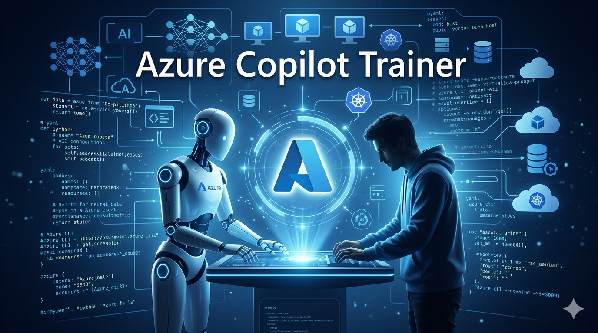

# Azure Training Agent Skills Starter Package

<!-- ![azure-copilot-trainer][1] -->

This package provides a production-ready blueprint and starter implementation for GitHub Copilot Agent Skills in VS Code focused on Azure training delivery.

## What you get

- Composable skills for course orchestration, service-specific instruction, learner state, anti-hallucination checks, scenario generation, assessment, and quality gates.
- Persistent learner progress model for pause/resume continuity.
- Guardrails for source-grounded answers and uncertainty handling.
- Scenario framework for role/industry/constraint-based implementation labs.
- Validation checklist and test cases for acceptance.

## Prerequisites

- VS Code with GitHub Copilot and Agent mode enabled.
- Agent Skills enabled: setting `chat.useAgentSkills` = true.
- Skills stored in `.github/skills` (project-level, versioned with repo).
- **Azure MCP Server**: active in this workspace (provides Azure service, resource, and best-practices tools). Configured via `ms-azuretools.vscode-azure-mcp-server` extension.
- **Microsoft Learn MCP Server**: active in this workspace (provides documentation search and retrieval tools). Configured in `.vscode/mcp.json`.
- **Bicep MCP Server**: active in this workspace (provides Bicep best practices, file diagnostics, resource schema, and AVM metadata tools). Configured via `ms-azuretools.vscode-bicep` extension.
- **PowerShell MCP Server**: active in this workspace (provides PowerShell script execution, syntax validation, and automation tooling). Configured via `ms-vscode.powershell` extension.
- Node.js 18+ (required to run npm-based MCP servers via `npx`).

## MCP server dependency

This solution uses four MCP servers to provide grounded, live-retrieved Azure content, official documentation, infrastructure-as-code tooling, and automation capabilities:

| Server                                      | Purpose                                                                     | Provided by                                       |
| ------------------------------------------- | --------------------------------------------------------------------------- | ------------------------------------------------- |
| Azure MCP                                   | Azure best practices, resource schemas, service documentation               | `ms-azuretools.vscode-azure-mcp-server` extension |
| Microsoft Learn MCP (`@microsoft/docs-mcp`) | Documentation search, page fetch, official code samples                     | `.vscode/mcp.json` (npm)                          |
| Bicep MCP                                   | Bicep best practices, file diagnostics, resource type schemas, AVM metadata | `ms-azuretools.vscode-bicep` extension            |
| PowerShell MCP                              | PowerShell script execution, syntax validation, automation task tooling     | `ms-vscode.powershell` extension                  |

Extension-provided MCP servers (Azure MCP, Bicep MCP, PowerShell MCP) are auto-discovered by VS Code when the corresponding extension is installed and active — no `mcp.json` entry is required for those. The Microsoft Learn MCP server is configured in `.vscode/mcp.json` and requires Node.js 18+ so `npx` can resolve and run the package.

## Skill map

1. `azure-training-orchestrator`: Creates and adapts the full training path.
2. `azure-service-path-apps`: Generates service modules for Azure App Service, Functions, Storage, Key Vault, Monitor.
3. `azure-learner-state`: Saves/restores learner state and resume token.
4. `azure-source-grounding`: Applies anti-hallucination checks and citation policy.
5. `azure-scenario-engine`: Generates realistic architecture and operations scenarios.
6. `azure-assessment-engine`: Builds formative/summative checks with remediation.
7. `azure-quality-gates`: Enforces objective acceptance checks and fail conditions.

## Suggested invocation order

1. `/azure-training-orchestrator Create a 6-week Azure app platform track for platform engineers`
2. `/azure-service-path-apps build modules for the generated track`
3. `/azure-scenario-engine generate scenarios for healthcare and fintech`
4. `/azure-assessment-engine create module quizzes and capstone rubric`
5. `/azure-quality-gates validate track artifacts against acceptance criteria`
6. `/azure-learner-state checkpoint learner Marc profile`

## Prompt pack workflows

- `/.github/prompts/azure-training-author.prompt.md`: complete authoring and quality gate workflow.
- `/.github/prompts/azure-self-paced-session.prompt.md`: autonomous learner session and checkpoint workflow.
- `/.github/prompts/azure-learner-resume.prompt.md`: deterministic resume and recovery workflow.
- `/.github/prompts/azure-self-paced-review.prompt.md`: periodic progress review and remediation planning workflow.

Use from chat by typing `/` and selecting:

1. `/azure-training-author`
2. `/azure-self-paced-session`
3. `/azure-learner-resume`
4. `/azure-self-paced-review`

## Data location for learner state

- `training-data/learners/<learner-id>.json`
- `training-data/checkpoints/<learner-id>-<timestamp>.json`

## Security defaults

- Minimize PII. Store learner ID and optional display alias only.
- Keep confidence labels and evidence links for generated content.
- Set retention and purge policy before production use.

## Source policy (mandatory)

- Use only learn.microsoft.com as evidence source when building training content.
- Every key training claim must include a verifiable proof link to learn.microsoft.com.
- Claims without learn.microsoft.com proof links must be treated as unverified and excluded from release output.

For a full operational guide, see [docs/how-to-use.md](docs/how-to-use.md).

[1]: /docs/media/azure_copilot_trainer.png
